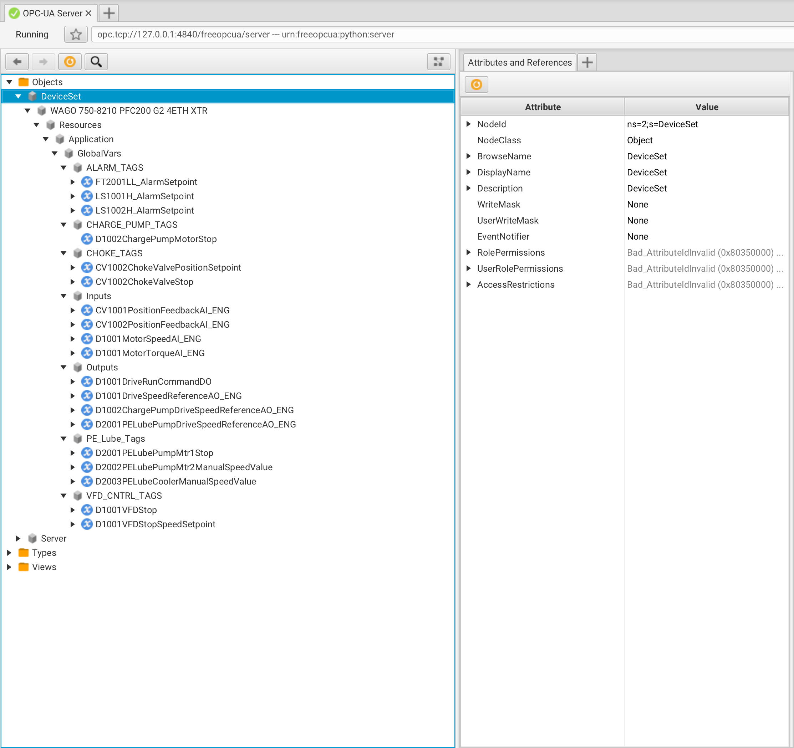

# OPC-UA Server 
The following provides a OPC-UA server for testing purposses. 



## Deployment
1. Install python3 with pip and OPCUA package
```shell
python3  -m pip install --upgrade pip 
python3  -m pip install --upgrade opcua>=0.0
```

2. Start OPC-UA service

When using authentication, the authetication type is `ua.SecurityPolicyType.Basic256Sha256_SignAndEncrypt`  - user: root | password: demo
```shell
python3 server.py [--conn 127.0.0.1:4840] [--string-mode {int, short, long}] [--enable-auth] 
```

## Data Structure
The Server has 103 data points, that rotate between _int_, _float_, _boolean_ and _char_ 
```tree
|- ns=2;s=DeviceSet
|-- ns=2;s=WAGO 750-8210 PFC200 G2 4ETH XTR
|--- ns=2;s=Resources
|---- ns=2;s=Application
|----- ns=2;s=GlobalVars
|------ ns=2;s=ALARM_TAGS
|------- ns=2;s=FT2001LL_AlarmSetpoint
|------- ns=2;s=LS1001H_AlarmSetpoint
|------- ns=2;s=LS1002H_AlarmSetpoint
|------ ns=2;s=CHARGE_PUMP_TAGS
|------- ns=2;s=D1002ChargePumpMotorStop
```

* View data based on idx as a long string
```shell 
/Users/orishadmon/opcua-connector/server.py --string long

# sample AnyLog/EdgeLake call + output
AL > get opcua values where url=opc.tcp://127.0.0.1:4840/freeopcua/server and node="ns=2;s=DeviceSet.WAGO 750-8210 PFC200 G2 4ETH XTR.Resources.Application.GlobalVars.ALARM_TAGS.FT2001LL_AlarmSetpoint" and include=all
OPCUA Nodes values
id                                                                                                   name                   source_timestamp           server_timestamp status_code value 
----------------------------------------------------------------------------------------------------|----------------------|--------------------------|----------------|-----------|-----|
ns=2;s=DeviceSet.WAGO 750-8210 PFC200 G2 4ETH XTR.Resources.Application.GlobalVars.ALARM_TAGS.FT2001|
LL_AlarmSetpoint                                                                                    |ft2001ll_alarmsetpoint|2025-04-05 03:13:07.003524|                |Good       |  105|
```

* View data based on idx as a short string
```shell
/Users/orishadmon/opcua-connector/server.py --string short

# sample AnyLog/EdgeLake call + output
AL > get opcua values where url=opc.tcp://127.0.0.1:4840/freeopcua/server and node="ns=2;s=FT2001LL_AlarmSetpoint" and include=all

OPCUA Nodes values
id                            name                   source_timestamp           server_timestamp status_code value 
-----------------------------|----------------------|--------------------------|----------------|-----------|-----|
ns=2;s=FT2001LL_AlarmSetpoint|ft2001ll_alarmsetpoint|2025-04-05 03:15:01.819446|                |Good       |  919|
```

* aaa
```shell
/Users/orishadmon/opcua-connector/server.py --string int 


# sample AnyLog/EdgeLake call + output
AL > get opcua values where url=opc.tcp://127.0.0.1:4840/freeopcua/server and node="ns=2;i=48090" and include=all

OPCUA Nodes values
id           name                   source_timestamp           server_timestamp status_code value 
------------|----------------------|--------------------------|----------------|-----------|-----|
ns=2;i=48090|ft2001ll_alarmsetpoint|2025-04-05 03:31:08.329521|                |Good       |  671|
```
